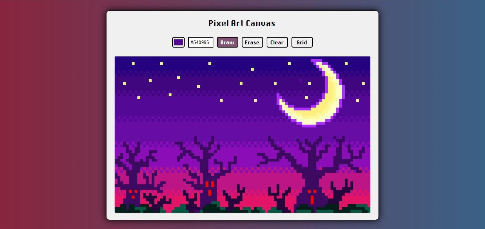

# Pixel Art Canvas

A small canvas that allows you to create simple figures or complex drawings in pixel art

## Features

- It is possible to choose any color to paint on the canvas.
- has a custom color picker.
- You can erase individual pixels with the eraser.
- It is possible to clean the entire canvas with a simple click.
- Grid lines can be enabled or disabled.
- Compatible with touch screen.
- Fully responsive.
- you can download an image with the work done on the canvas

## Preview

### Credits

This project uses the [TinyColor](https://github.com/bgrins/TinyColor) library to manage the color picker function.
